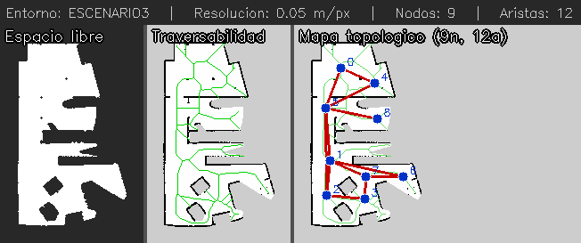
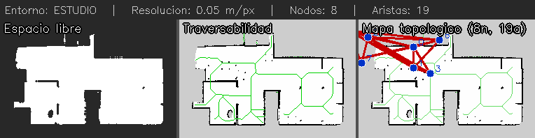
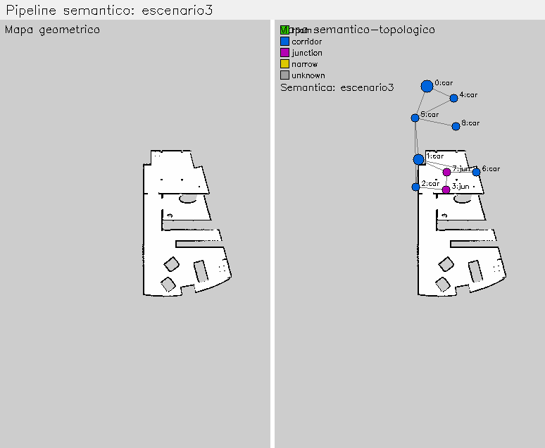
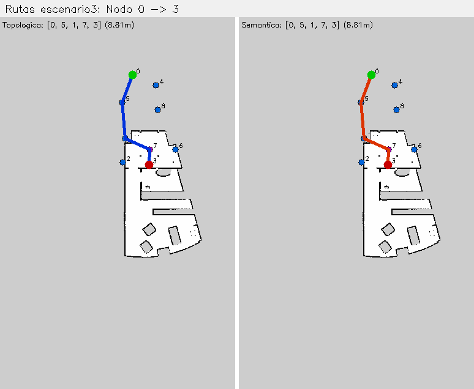

# Autonomous Navigation System for Mobile Robots
### Topological and Semantic Navigation — Master's in Robotics & Automation

This project implements a **three-level navigation stack** for a TurtleBot3 in simulated environments (ROS Noetic + Gazebo). Each level builds on the previous one, progressively adding intelligence to how the robot understands and traverses its environment.

---

## The three navigation levels

```
┌─────────────────────────────────────────────────────────┐
│  Level 3 — Semantic   "navigate to the nearest room"    │
│     ↑ enriches with region types and traversal costs    │
│  Level 2 — Topological  "go to node 6 via nodes 1, 7"  │
│     ↑ built from                                        │
│  Level 1 — Geometric  "avoid obstacles, map the space"  │
└─────────────────────────────────────────────────────────┘
```

---

## Level 1 — Geometric: Autonomous Exploration

The robot explores unknown environments autonomously using **Frontier-Based Exploration**: it continuously identifies the boundary between mapped and unknown space and navigates toward the nearest reachable frontier until the map is complete.

**Results across 4 environments:**

| Environment | Time | Coverage |
|-------------|:----:|:--------:|
| Scenario 1  | 3 min 09 s | 100.1 % |
| Scenario 2  | 7 min 13 s | 99.8 %  |
| Scenario 3  | 7 min 50 s | 91.6 %  |
| Study       | 7 min 02 s | 99.9 %  |

The resulting PGM maps feed directly into the topological layer.

→ See [`navegacion_geometrica/`](navegacion_geometrica/README.md)

---

## Level 2 — Topological: Graph-Based Navigation

The geometric map is transformed into a **topological graph** where nodes represent the most open points in free space and edges connect navigable regions. Path planning uses **A\*** with Euclidean distance as heuristic.

**Pipeline (Scenario 3 — most complex, 9 nodes):**



*Left: free space mask. Centre: traversability map with skeleton. Right: topological graph (9 nodes, 12 edges) superimposed on the map.*

**Study environment** (8 nodes, 19 edges — multi-room floor plan):



**How nodes are placed:**
1. Extract free-space mask from PGM (threshold > 220)
2. Skeletonize with `scikit-image` morphological thinning
3. Compute Distance Transform → local maxima = node positions (farthest from walls)
4. Connect nodes within 100 px with line-of-sight check

→ See [`navegacion_topologica/`](navegacion_topologica/README.md)

---

## Level 3 — Semantic: 3D Region Classification

Each topological node is **classified by the volumetric properties of the space around it**, using a 3D projection of the 2D map data (`SemanticMapper3D`):

- `distance_to_wall` (metres) → `width = dtw × 2`, `height = 2.5 m` (standard indoor ceiling)
- `SemanticMapper3D._classify_region(width, height, volume)` applies 3D thresholds
- Ray-casting distinguishes `junction` (corridor open in ≥ 3 directions) from `corridor`

| Label | Width | Traversal cost | Risk |
|-------|:-----:|:--------------:|:----:|
| `room`     | ≥ 2.0 m | 0.70 | low    |
| `corridor` | 0.8–2.0 m | 1.00 | low  |
| `junction` | 0.8–2.0 m + open dirs | 1.20 | medium |
| `narrow`   | < 0.8 m | 1.80 | high  |

**Semantic map — Scenario 3** (🟢 room · 🟣 junction):



*Left: raw geometric map. Right: semantic-topological graph — green nodes are rooms (free, wide), purple nodes are junctions (crossings).*

### Semantic routing vs. topological routing

The semantic A\* assigns different edge costs based on node type, producing **genuinely different routes** in 8 of the 36 possible node pairs in Scenario 3. The most striking example:



| | Route | Distance | Semantic cost |
|--|-------|:--------:|:-------------:|
| 🔵 Topological | `2 → 3 → 7 → 6` | 5.51 m | 4.8 (all junctions) |
| 🟢 Semantic    | `2 → 1 → 6`     | 6.16 m | 3.1 (via room)      |

The semantic planner accepts +0.65 m in exchange for passing through a room node (cost 0.70) instead of two junction nodes (cost 1.20 each), reducing total semantic cost by **−1.70**.

→ See [`navegacion_semantica/`](navegacion_semantica/README.md) · Full simulation guide: [`SIMULACION.md`](navegacion_semantica/SIMULACION.md)

---

## Technologies

`ROS Noetic` · `Gazebo` · `Python 3.8` · `OpenCV` · `scikit-image` · `NumPy/SciPy` · `TurtleBot3`

---

## Quick start

```bash
# 1. Install Python dependencies
pip install pyyaml opencv-python scikit-image numpy scipy

# 2. Build workspace
cd ~/Ubuntu20noetic_ws && catkin_make && source devel/setup.bash

# 3. Generate all topological graphs
cd $(rospack find navegacion_topologica)/scripts && python3 generate_all_maps.py

# 4. Generate semantic graphs + figures
cd $(rospack find navegacion_semantica)
python3 semantic_enricher.py && python3 generate_semantic_results.py
```

**Run the full semantic navigation demo (Scenario 3):**

```bash
# T1 — Gazebo
export TURTLEBOT3_MODEL=burger
roslaunch navegacion_geometrica turtlebot3_escenario3.launch

# T2 — Navigation stack
roslaunch turtlebot3_navigation turtlebot3_navigation.launch \
  map_file:=$(rospack find navegacion_geometrica)/mapas/exploration/mapa_escenario3.yaml

# T3 — Semantic navigation node
rosrun navegacion_semantica semantic_navigation.py \
  $(rospack find navegacion_topologica)/mapas/grafos/escenario3_grafo_semantico.json
```

---

## Repository structure

```
robots_moviles/
├── navegacion_geometrica/    # Frontier exploration + coverage evaluation
├── navegacion_topologica/    # Graph generation + A* path planner + ROS node
├── navegacion_semantica/     # 3D region classification + semantic A* + ROS node
└── SLAM/                     # EKF-SLAM implementation in MATLAB (separate task)
```
